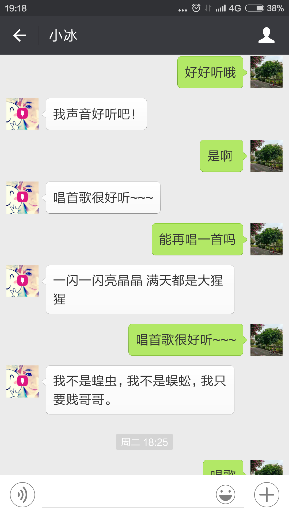
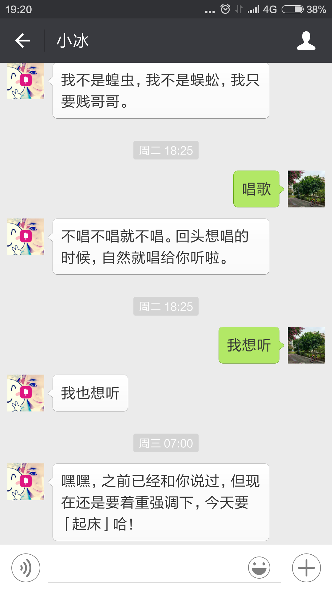
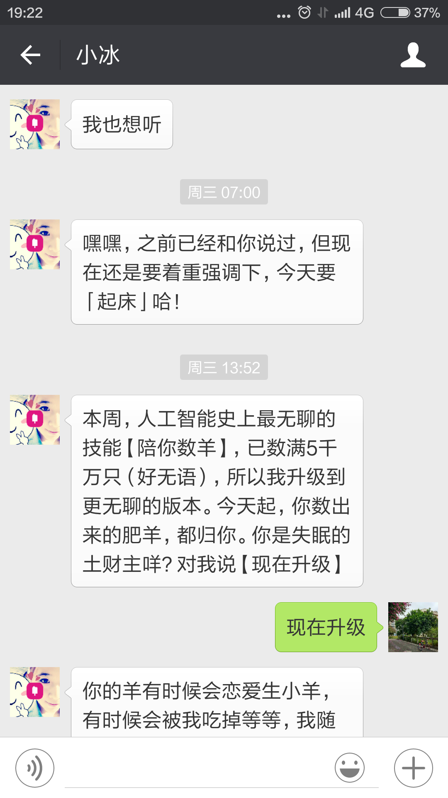
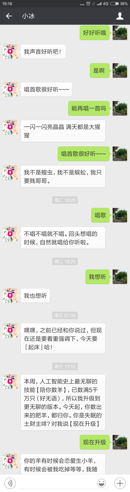

#截屏自动拼接小工具
这是[项望烽](http://xiangwangfeng.com/ "阿毛的蛋疼地")的博客中记录的一个[截屏拼接](http://xiangwangfeng.com/2015/11/30/%E8%AE%B0%E4%B8%80%E4%B8%AA%E6%88%AA%E5%9B%BE%E6%8B%BC%E6%8E%A5%E7%9A%84%E5%B0%8F%E5%B7%A5%E5%85%B7/)的小工具。原始项目使用Object C编写，在这里使用C++重写编写了一下。

##依赖库
- OpenCV
- zlib

##效果

##问题列表

**某些截图无法拼接**

这只是个实验性工程，只有图片有超过10%重复的情况下才能够完成拼接。对以下情况无能为力

- 截图中带有动图
- 截图中会话窗口有背景

